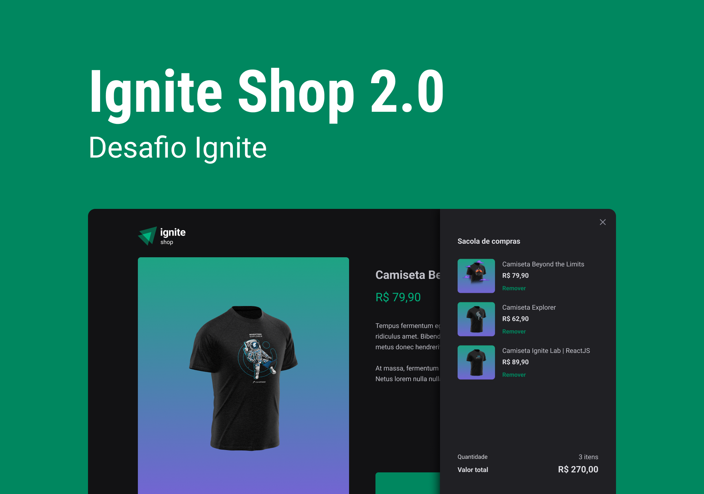

<div align="center">
  
  <h3>Mini loja virtual desenvolvida com next.js e stripe para a trilha de react do bootcamp Ignite da Rocketseat.</h3>
</div>

## 📃 Sobre

<br />

Este projeto foi desenvolvido para a trilha de react do bootcamp ignite da rocketseat e tem como foco ensinar ao aluno como fazer uma integração com o meio de pagamento stripe além de abordar conceitos como Shimmer Effect e gerenciamento de um carrinho de compras. 

## 💻 Principais Tecnologias utilizadas no projeto

Para realizar este projeto precisei utilizar algumas bibliotecas bem legais e úteis, como immer (para a manipulação do estado de carrinho de compras) e framer-motion (para fazer a animação da sidebar) além das que forma utilizadas nas aulas anteriores. abaixo você pode ver todas elas: 

- [Vite](https://vitejs.dev/)
- [React](https://pt-br.reactjs.org/)
- [Typescript](https://www.typescript)
- [Stitches](https://stitches.dev/)
- [Phosphor-icons](https://phosphoricons.com/)
- [Stripe](https://stripe.com/br)
- [Immer](https://www.npmjs.com/package/immer)
- [Framer-motion](https://www.framer.com/motion/)
- [Keen-slider](https://keen-slider.io/)

## Funcionalidades

Este projeto possui algumas funcionalidades bem comuns em uma loja virtual, como por exemplo:

- Listagem de produtos (camisetas) disponíveis para compra

- Adicionar produtos ao carrinho

- Remover produtos do carrinho

- Exibir o total de produtos no carrinho no Header

- Exibir o valor total da soma de itens no carrinho multiplicados pelo valor

- Realização de compra direto no checkout da stripe ao finalizar a compra

## Como executar o projeto na sua máquina

<br />

Para executar o projeto você terá de seguir os passos listados abaixo. 

Primeiro clone o repositório do projeto com o comando:

<br />

```bash
git clone git@github.com:henrique998/Ignite-Shop.git
```

Execute um dos comando abaixo para instalar as dependências do projeto:

```bash
npm install
# OU
yarn install
```

<br />

Preencha as variáveis contidas no arquivo ".env" com as suas chaves da sua conta do stripe.

<br />

Agora está tudo pronto para iniciar o projeto. execute o comando abaixo para iniciar o servidor:

<br />

```bash
npm run dev
# OU
yarn dev
```

## Contato

<br />

Entre em contato comigo por email ou no linkedin:

- henriquemonteiro037@gmail.com
- [linkedin](https://www.linkedin.com/in/henrique-monteiro1/)